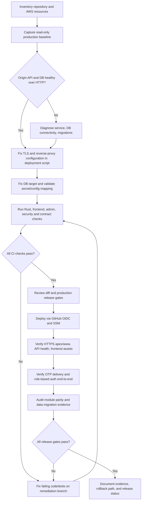

# TrackMyRMC Production Audit and Remediation Plan

Audit baseline: 2026-10-10
Repository: `Aakruti7870/Track-My-RMC`
Production region: `ap-south-1`
Production EC2: `i-0598aad6e6d729c69`
Production database: RDS PostgreSQL `trackmyrmc-postgres`

## Execution flow

## Baseline confirmed so far

- Local Windows checkout and GitHub CLI authentication are working; local `main` matches remote `main` at `38fc9fc824d711d0fafe9dbd9e26d4d4de371259`.
- Production EC2 is running in Mumbai region (`ap-south-1`), SSM reports the instance online, and the artifact bucket exists.
- RDS PostgreSQL is available, private, encrypted, has deletion protection enabled, and has a seven-day backup retention period.
- EC2-local HTTP health returns `status=ok`, `database=connected`. This is not proof of correct database selection or data parity.
- The current deployment script writes an Nginx HTTP-only server block. No origin certificate was found under the checked Let's Encrypt/SSL paths; public HTTPS previously returned Cloudflare 521.
- The deploy script builds `DATABASE_URL` with database name `postgres`; the RDS instance metadata names `trackmyrmc` as the application database. This mismatch must be resolved and the actual live DB target verified before cutover.
- The workflow can create `trackmyrmc/app-runtime` with blank provider credentials if the secret is absent. Production OTP delivery must be checked without printing secret values.
- The current module parity audit documents major missing or partial Rust API domains compared with the original FastAPI/MongoDB implementation. A health endpoint does not establish functional parity.
- A read-only SSM diagnostic confirmed both the backend and Nginx services are active and the Nginx configuration parses. The production runtime secret contains keys for WhatsApp and email providers; key presence alone does not prove provider credentials work.

## Phased work and release gates

1. **Repository inventory:** inspect route registration, auth services, DB pool/migrations, mobile/admin clients, CI workflows, deployment script, and module-parity audit.
2. **Production baseline:** capture service status, listener ports, Nginx configuration, TLS files, SSM health, secret key presence only, DB name/migration status, and HTTP/HTTPS behavior. Never print credentials or personal data.
3. **Availability and database fixes:** make TLS provisioning persistent across every deployment; keep Cloudflare Full (strict); ensure app connects to the intended `trackmyrmc` database; preserve backups and avoid destructive schema/data changes.
4. **Automated verification:** Rust format/check/clippy/tests, frontend typecheck and route/policy checks, admin build, deployment workflow validation, and targeted auth/OTP tests.
5. **Deploy from a review branch:** deploy only after CI passes; use existing GitHub OIDC/SSM deployment path; capture release SHA and SSM command result.
6. **Live smoke tests:** HTTPS apex and www, health, API response, frontend index/assets, redirects, TLS validity/hostname, and rollback readiness.
7. **Authentication:** test customer/driver WhatsApp OTP and staff email OTP→TOTP/recovery using authorized test accounts; verify failures/rate limits/session revocation. Never disclose OTPs/tokens.
8. **Parity/data audit:** compare source domains and Rust route coverage, verify production schema/migration state and record-count/relationship evidence before declaring migration complete.
9. **Release decision:** mark each gate PASS/FAIL/NOT VERIFIED with evidence; do not claim production-ready while any critical gate is unverified.

## Safety constraints

- Do not print or commit runtime secrets, database credentials, OTPs, personal records, or provider tokens.
- Do not modify DNS or weaken Cloudflare SSL mode.
- Do not run destructive migrations, truncate/delete production data, disable database deletion protection, or force-push.
- Keep changes on `fix/production-audit-and-https` until CI and diff review are complete.
- Any deployment must retain a known-good release artifact and be reversible.
